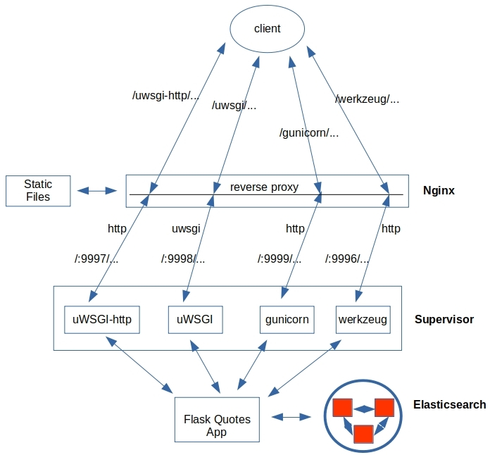

# A Flask Full of Whiskey (WSGI)
Serving up python web applications has never been easier with the suite of WSGI servers at our disposal. Both uWSGI and gunicorn behind Nginx are excellent performers for serving up a Flask app…

This is the source code to go along with the blog article

[A Flask Full of Whiskey (WSGI)](http://xplordat.com/2020/02/16/a-flask-full-of-whiskey-wsgi/)

*Figure 1. The web server and the python application communicate via an intermediate WSGI server that translates between the http and wsgi protocols. The WSGI server is not just a translator of course. It is threaded to distribute the incoming requests over multiple instances of the Flask app.*

##	The app

It is simple. Just return a random quotation from an Elasticsearch index.

*Figure 2. What are we learning from this blog post?*

##	Summary results

Based on the simple test application:

	1.	The uWSGI server (using the uwsgi protocol) behind Nginx is the best performer
	2.	You cannot go wrong with gunicorn either with/without Nginx
	3.	Avoid placing the uWSGI Http server behind Nginx, just as they recommend on their website
	4.	Do not use the default werkzeug server in production

##	Python Dependencies
	Flask
	uwsgi
	gunicorn
	elasticsearch (if Elasticsearch is your backend data source)

##	System Dependencies
	supervisor
	nginx
	cmonitor-collector
	Elasticsearch (or other of your preference)

##	To reproduce the results

**Fix the paths in conf.d/ files. Paths for python/gunicorn/uwsgi and this quoteserver directory in your setup**

	sudo cp nginx.conf /etc/nginx
	sudo cp conf.d/* /etc/supervisor/conf.d

	sudo systemctl restart nginx
	sudo systemctl restart supervisor

	cd load-tests

###	To run with 60 workers, with 500 clients hatching at 10 per second, and for a duration of 60 minutes

	./all_runLoadTest.sh 500 10 60

###	To run with 6 workers, with 500 clients hatching at 10 per second, and for a duration of 60 minutes
	Edit quoteserver/config.py & the conf.d/uwsgi* files to change 60 to 6

	Restart supervisor

	./all_runLoadTest.sh 500 10 60

##	Flow of calls with Nginx in place

*Figure 4. The flow and routing of requests from the client when Nginx fronts the WSGI servers.*

##	Performance comparison

*Figure 7. Increasing the number of workers does not have a huge impact in our case. The uWSGI server behind Nginx is the best performer, followed by gunicorn with/without Nginx.*

